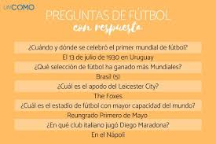
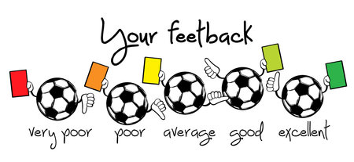
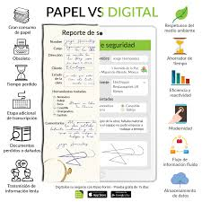

## APP_FUTBOL
Has pensado alguna vez en tener una app de predicciones donde podras ver y compartir tus pronosticos de tus partidos
favoritos con todo el mundo.
donde podras interactuar con especialistas del futbol pie.
ademas tambien podras crear tu grupo de analistas deportivos.

ADEMAS DE TODO NUESTRA APP CONTARA CON UNA OPCION DONDE PODRAS REALIZAR PREGUNTAS SOBRE EL FUTBOL EN GENERAL
Y ASI APRENDER SOBRE SU HISTORIA

# PROBLEMA
El futbol es un deporte raro donde pueden pasar muchas cosas, entonces aveces es muy dificil pronosticar un partido
y chuntarla como se dice.

# MVP
prsentar un ejemplo de la app alas personas, esta seria "flashcore" que seria muy similar a nustra idea pero en cambio
en nustra app se podra interactuar y contara con mas opciones.
 <agit add <archivo.txt>rchivo.txt>
ESTA LA PUBLICARE POR TIK TOK YA QUE SE MOVERA MAS RAPIDO

# HERRAMIENTAS 

- TIK TOK

usare el tik tok como aplicacion para compartir mi idea.

 o.txt>

- USARE EL FORMULARIO:

 PARA REALIZAR UNA ENCUESTA:

 

 # APRENDER

 Despues de ver las reacciones y tener en cuenta tambien la encuesta que emos realizado vamos a ver si nuestra idea llama la atencion de las personas y tomaremos en cuenta los comentarios y mejorar
 ya que nuestra app tiene la intencion de satisfacer las necesidades de la gente .

 # PIVOTE

 

 NUESTRA APP_FUTBOL LLAMO MUCHA ATENCION DE LA GENTE ASI QUE NO TENDREMOS QUE PIVOTEAR NUESTRA IDEA, YA QUE ESTA NOS BENEFICIARA A NOSOTROS Y ALAS PERSONAS QUE PODTRAN CONTAR CON ELLA.
 YA QUE SERA FACIL DE USAR Y AYUDARA MUYCHO ALAS PERSONAS.

 # modelo baja de nuestra app:

  -1.png)

